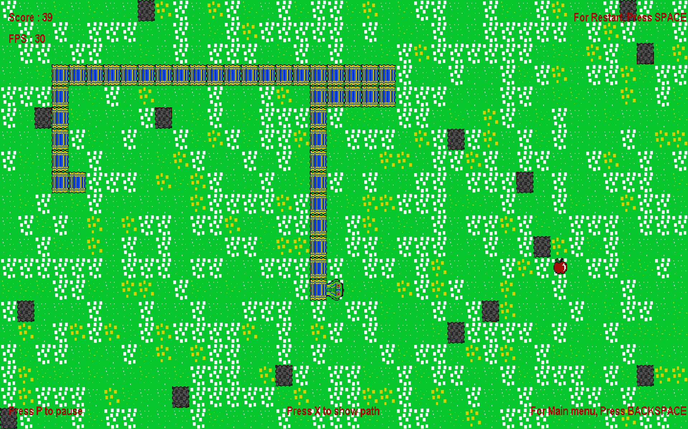

# Feed The Snake 🐍

A classic Snake game built with Java and Swing, packed with multiple gameplay modes and a smart AI to challenge you. This project is a modern take on a timeless arcade game, showcasing clean architecture and object-oriented principles.



---

## ✨ Features

* **Classic Gameplay**: Enjoy the simple yet addictive fun of the original Snake game.
* **Multiple Game Modes**:
    * **4D Mode**: Standard four-directional movement.
    * **8D Mode**: Advanced eight-directional movement for a tougher challenge!
    * **AutoPlay Mode**: Watch a smart AI, powered by the A* pathfinding algorithm, play the game perfectly on its own.
* **Persistent High Scores**: Your highest score is automatically saved, so you can always come back to beat your personal best.
* **Game Recording**: Watch a replay of your previous game.
* **Adjustable Speed**: The game's speed and FPS increase as you score, keeping the challenge fresh.
* **Dynamic UI**: Clean and intuitive user interface built with Java Swing.

---

## 🎮 How to Play

### Main Menu Navigation
* **Up/Down Arrows** or **W/S Keys**: Navigate through the menu options.
* **Enter**: Select an option.

### In-Game Controls

| Action            | 4D Mode                | 8D Mode (NumLock ON) | General             |
| ----------------- | ---------------------- | -------------------- | ------------------- |
| **Move Up** | `W` / `Up Arrow` / `8` | `8`                  | -                   |
| **Move Down** | `S` / `Down Arrow` / `2` | `2`                  | -                   |
| **Move Left** | `A` / `Left Arrow` / `4` | `4`                  | -                   |
| **Move Right** | `D` / `Right Arrow` / `6`| `6`                  | -                   |
| **Move Diagonally**| -                      | `1`, `3`, `7`, `9`   | -                   |
| **Pause/Resume** | -                      | -                    | `P`                 |
| **Restart Game** | `Spacebar`             | `Spacebar`           | `Spacebar`          |
| **Toggle Fullscreen**| -                   | -                    | `F` (requires restart) |
| **Return to Menu**| -                      | -                    | `Backspace`         |
| **View High Score**| -                      | -                    | `H` (on title screen)|
| **View Replay** | `R`                    | `R`                  | `R` (on game over screen)|

---

## 🛠️ How to Build and Run

This project uses **Apache Maven** to manage dependencies and build the application.

### Prerequisites

* Java Development Kit (JDK) 11 or higher.
* Apache Maven.

### Building from Source

1.  **Clone the repository:**
    ```bash
    git clone [https://github.com/your-username/feed-the-snake.git](https://github.com/your-username/feed-the-snake.git)
    cd feed-the-snake
    ```
2.  **Compile and package the application using Maven:**
    ```bash
    mvn clean package
    ```
    This will create an executable `.jar` file in the `target/` directory.

### Running the Game

After building, you can run the game with the following command:
```bash
java -jar target/classes/com/Main/Launcher.jar